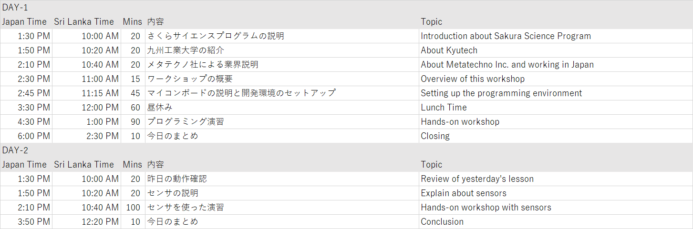
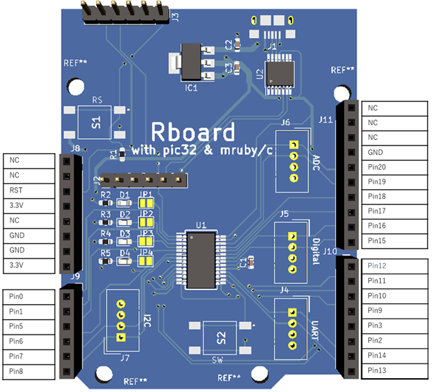

# SAKURA Science Workshop 2021

~~Zoom meeting url: https://kyutech-ac-jp.zoom.us/j/84610950922?pwd=U2l5Tlh6RHVtQUpXWDhxQ3dWKzhjUT09~~

- ~~Zoom meeting ID: 846 1095 0922~~
- ~~Pass: 345784~~

# Schedule

# Setup IDE

1. Download [IDE(Integrated Development Environment) file (mrubyc_ide1.02_win.zip)](https://github.com/mruby-lab/sakura_science_2021/blob/main/mrubyc_ide1.02_win.zip)
2. Extract zip file to Desktop
3. Launch mrubyc_ide.exe
4. Connect USB cable to Rboard 
5. Setup "Writer port"
    1. [File]-[Settings] menu
    2. select [Build and Deploy]
    3. select [Writer] tab
    4. choose Port, USB Serial (COMxx)

# Slide

## Day1

- [Slide 1 (PDF)](https://github.com/mruby-lab/sakura_science_2021/blob/main/IoT_Workshop_Day1-1.pdf)
- [Slide 2 (PDF)](https://github.com/mruby-lab/sakura_science_2021/blob/main/IoT_Workshop_Day1-2.pdf)
- [JST Sakura Science Exchange Program](https://ssp.jst.go.jp/EN/pamph/index.html)
- [Kyutech Video "Hello! KYUTECH"](https://www.kyutech.ac.jp/information/video_hellokyutech_e.html)

## Day2

- [Slide 1 (PDF)](https://github.com/mruby-lab/sakura_science_2021/blob/main/IoT_Workshop_Day2-1.pdf)
- [Slide 2 (PDF)](https://github.com/mruby-lab/sakura_science_2021/blob/main/IoT_Workshop_Day2-2.pdf)

# Pins

